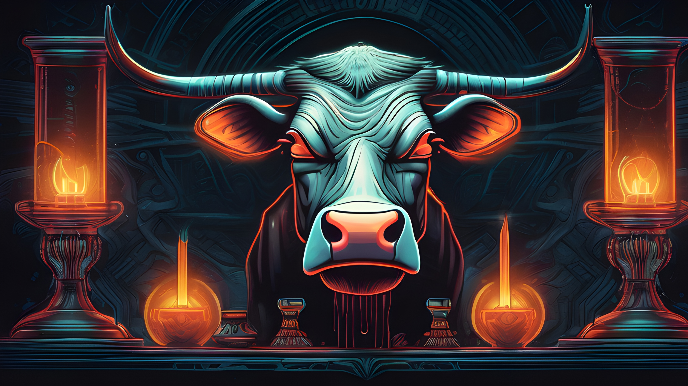
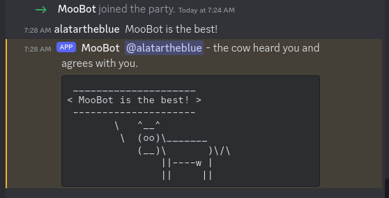

# Cow Goes Moo Discord Bot
This is just a silly Discord bot. It reads each message in each channel that is visible and draws a random number. If the number is divisible by 2046, the bot will echo the user message into the same channel via cowsay.

# Details
## Environment Variables
* **MOOBOTADMIN** - _the Discord bot token_
* **MOOBOTTOKEN** - _the Discord UID of the admin.  This user is allowed to use `ping` and `list servers`_
* **MOOBOTLOGOURL** - _URL to the image to use as the logo image in embeds_

## Admin Commands
* `ping` - answers with Pong
* `list servers` - lists the servers that the bot is currently in
* `about cow` - shows an About message

## User Commands
None.  It's not that kind of bot.  The admin commands really were just so I could test the thing. 

# Credit
[From Wikipedia](https://en.wikipedia.org/wiki/Cowsay):
> cowsay is a program that generates ASCII art pictures of a cow with a message.[2] It can also generate pictures using pre-made images of other animals, such as Tux the Penguin, the Linux mascot. It is written in Perl. There is also a related program called cowthink, with cows with thought bubbles rather than speech bubbles. .cow files for cowsay exist which are able to produce different variants of "cows", with different kinds of "eyes", and so forth.[3] It is sometimes used on IRC, desktop screenshots, and in software documentation. It is more or less a joke within hacker culture, but has been around long enough that its use is rather widespread. In 2007, it was highlighted as a Debian package of the day.[4] 
